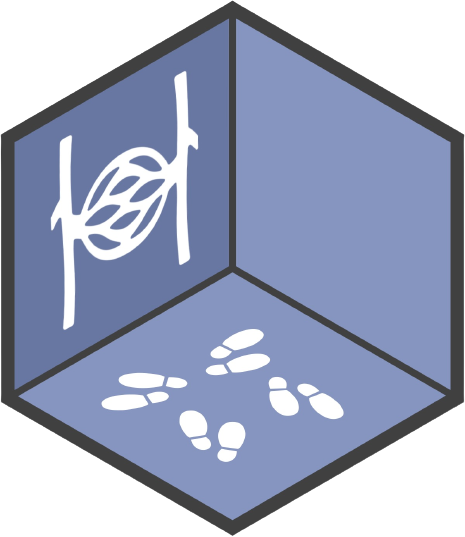
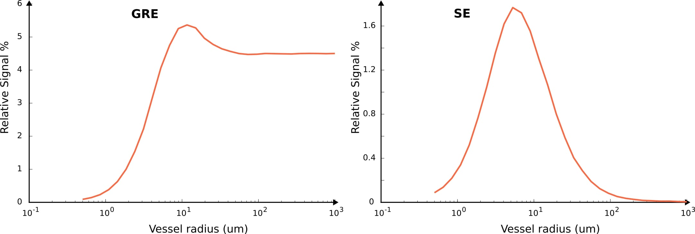

<div align="center">


</div>

<p align="center">
<a href="https://github.com/aghaeifar/SpinWalk">

</a>
</p>

<p align="center">
<strong>Spins Random Walk Simulator</strong>
<br />
</p>

This program aims to simulate the behaviour of spins under a certain MR sequence in a microvascular network. Breifly, the susceptibility variation between blood and tissue leads to local field inhomogeneity which accordingly can be used to generate an MR contrast. The program tries to perform a Monte-Carlo simulation over range of spins which are randomly distributed and move in presence of user defined magnetic field. Here are example plots obtained from the simulator where show BOLD sensitivity as a function of vessel size for Gradient Echo (GRE) and Spin Echo (SE) seqeuences.



Some [literature](#Literature) are provided as reference to get a better feeling of what are intended to get from this kind of simulations.

Simulator is written in C++ and utilizes CUDA to run in GPU. Therefore, it is possible to run a simulation within a short period of time provided that a good GPU presents. Simulator can detect all GPU cards, if there is more than one, and can distribute the task to run in parallel in multiple GPUs. This is helpful if you wan to run the simulator in HPC cluster with mutliple GPUs available in a node.

## How to run

```
./spinwalk -c my_config.ini 
```

Several config files can be simulated sequentially:

```
./spinwalk -c config1.ini config2.ini ...
```

## Dependencies

- A C++ compiler supprting C++ 17
- CUDA driver (*nvidia-smi* and *nvcc --version* must run in terminal)
- Boost libraries ([+](https://www.boost.org/))
- HDF5 Library ([+](https://www.hdfgroup.org/downloads/hdf5))

## How to build
### Docker
We suggest utilizing the provided Dockerfile, which automates the installation of all dependencies, as well as the cloning and building of the program. Download the [Dockerfile](./Dockerfile) to your current directory and then execute the following commands:

```
docker build -t spinwalk .
docker run --gpus all --rm -it --runtime=nvidia spinwalk bash
```
Execute the **spinwalk** command, and you'll encounter the help menu along with the list of available GPU(s) in the output.
### CMake
If you prefer to install the program without using Docker, follow these steps (in Ubuntu):

```
sudo apt-get update && apt-get install -y libboost-all-dev libhdf5-dev
git clone https://github.com/aghaeifar/SpinWalk.git
cd SpinWalk
cmake -B ./build
cmake --build ./build --config Release
```


## Configuration files

Configruation file is a text based [ini file](https://en.wikipedia.org/wiki/INI_file) used to provide simulation parameters for simulator. Simulator can accept more than one configuration to simulation several configurations. A configuration file can inherit from another configuration file to avoid writing repetitive simulation parmeters. All the possible parameters are provided in [config_default.ini](./config/config_default.ini) with definition and expected unit.

## Input/Output file format
Spinwalk processes three distinct input files and produces a single output file. All files are stored on disk in _Hierarchical Data Format version 5_ ([HDF5](https://en.wikipedia.org/wiki/Hierarchical_Data_Format)) format. Reading and writing HDF5 file is natively supported by [MATLAB](https://www.mathworks.com/help/matlab/hdf5-files.html). Pythonic interface to work with HDF5 files is also avaialbe through [H5py](https://pypi.org/project/h5py/) package. Input files can be specified within the [FILES] section of the configuration file, while output filename is automatically generated and is stored in the output folder defined under the same [FILES] section in the configuration file.

### Inputs
#### Fieldmap

The simulation requires at least one fieldmap file. The fieldmap file comprises both an off-resonance map and a mask. The inclusion of the off-resonance map is optional. When the off-resonance map is not included, it is assumed to be zero. The off-resonance must be normalized to the static magnetic field where is intended to be used for simulation (i.e., fieldmap must be calculated for 1T). It will be internally scaled to the given B0 paramater in configuration file. The fieldmap file is stored in HDF5 format and includes following datasets:

- `fov` : 3x1 single-precision floating-point array containing length/fov of 3D sample. Unit is meter. 
- `mask` : 3D 8-bit unsigned integer array indicating tissue types. The values within the mask are utilized to distinguish between various tissue or object types. Each object type must have its own T1 and T2 values defined in the configuration files.
- `fieldmap` : (optional) 3D single-precision floating-point array indicating off-resonance map. Unit is Tesla.
  
Size of mask and fieldmap must match.

Example MATLAB script to write a fieldmap file can be like:
```matlab
filename = 'fieldmap.h5';
h5create(filename, "/fov", size(fov), 'Datatype','single');
h5write(filename, "/fov", fov);

h5create(filename, "/mask", size(mask), 'Datatype','uint8');
h5write(filename, "/mask", mask);

if(isempty(fieldmap) == false)
    h5create(filename, "/fieldmap", size(fieldmap), 'Datatype','single');
    h5write(filename, "/fieldmap", fieldmap);
end
```


Multiple fieldmap files can be defined in the configuration file. Spinwalk will simulate them sequentially.


#### M0 and XYZ0 [optional]

M0 and XYZ0 are two additional inputs in configuration file which define starting magnization and initial spatial position of spins, respectively. These two are optional inputs, if not set or empty, spins will be positioned randomly with M0 = [0, 0, 1].

M0 and XYZ0 are of size *3 * number of spins* and stored as single-precision floating-point array in HDF5 file. Example MATLAB script to write M0 and XYZ0 file can be like:

```matlab
filename = 'XYZ0.h5';
h5create(filename, "/XYZ", size(XYZ0), 'Datatype','single');
h5write(filename, "/XYZ", XYZ0);
filename = 'M0.h5';
h5create(filename, "/M", size(M0), 'Datatype','single');
h5write(filename, "/M", M0);
```

```
x0 y0 z0 x1 y1 z1 x2 y2 z2 .... xn yn zn
```

unit for spatial position  in XYZ0 is meter.

### Outputs

The simulator generates a single output for each fieldmap input. The output contains: 
- `M` : 4D single-precision floating-point array indicating the magnetization of spins at echo time(s). The dimentions are [xyz (3), echos, spins, scales]
- `T` : 4D 8-bit unsigned integer array indicating the tissue or object type where spins are located at the time of the echo. The dimentions are [1, echos, spins, scales]
- `XYZ` : 4D single-precision floating-point array indicating thethe spatial positions for either the entire random walk or just the final position. The dimentions are [xyz (3), steps, spins, scales]
- `scales` : 1D double-precision floating-point array indicating scales used to scale the length/FoV of sample.
  
The paths to save outputs can be specified in the configuration file. the filename pattern is _seqname_fieldmap.h5_, where seqname and fieldmap are both defined by user in the configuration file.

Example MATLAB script to read output file:

```matlab
filename = 'output.h5';
M1 = h5read(filename, '/M');
scales = h5read(filename, '/scales');
T = h5read(filename, '/T');  
```
## Literature

There are many nice papers published about simulation of BOLD signal in vessels network. A few are listed here for reference:

- Bieri O, Scheffler K. Effect of diffusion in inhomogeneous magnetic fields on balanced steady-state free precession. NMR Biomed. 2007 Feb;20(1):1-10. doi: 10.1002/nbm.1079. PMID: 16947639.
- Báez-Yánez MG, Ehses P, Mirkes C, Tsai PS, Kleinfeld D, Scheffler K. The impact of vessel size, orientation and intravascular contribution on the neurovascular fingerprint of BOLD bSSFP fMRI. Neuroimage. 2017 Dec;163:13-23. doi: 10.1016/j.neuroimage.2017.09.015. Epub 2017 Sep 8. PMID: 28890417; PMCID: PMC5857886.
- Boxerman JL, Hamberg LM, Rosen BR, Weisskoff RM. MR contrast due to intravascular magnetic susceptibility perturbations. Magn Reson Med. 1995 Oct;34(4):555-66. doi: 10.1002/mrm.1910340412. PMID: 8524024.
- Khajehim M, Nasiraei Moghaddam A. Investigating the spatial specificity of S2-SSFP fMRI: A Monte Carlo simulation approach. Magn Reson Imaging. 2017 Apr;37:282-289. doi: 10.1016/j.mri.2016.11.016. Epub 2016 Nov 24. PMID: 27890778.
- Weisskoff RM, Zuo CS, Boxerman JL, Rosen BR. Microscopic susceptibility variation and transverse relaxation: theory and experiment. Magn Reson Med. 1994 Jun;31(6):601-10. doi: 10.1002/mrm.1910310605. PMID: 8057812.
- Scheffler K, Engelmann J, Heule R. BOLD sensitivity and vessel size specificity along CPMG and GRASE echo trains. Magn Reson Med. 2021 Oct;86(4):2076-2083. doi: 10.1002/mrm.28871. Epub 2021 May 31. PMID: 34056746.

## Contributing

Contributions from the community to enhance and improve this project are welcome. For major changes, please open an issue first to discuss what you would like to change.