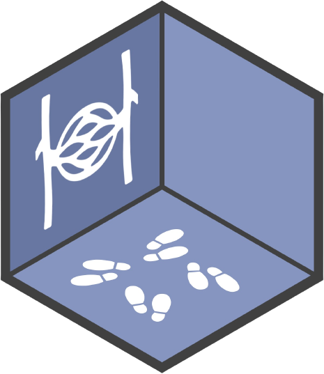
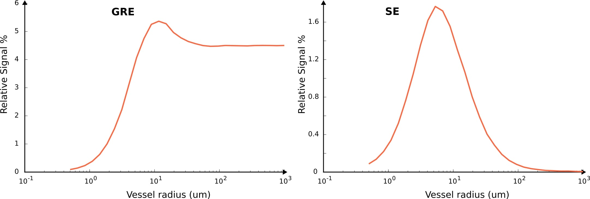

<p align="center">
<a href="https://github.com/aghaeifar/SpinWalk">

</a>
</p>

<p align="center">
<strong>Spins Random Walk Simulator</strong>
<br />
</p>

<div align="center">


</div>


**SpinWalk** is a Monte Carlo diffusion simulator. It simulates the random walk of spins (particles) under a specific MR sequence within a digital phantom, which can represent structures such as microvascular networks, cells, axons, and more.

---

### Key Features
- **GPU and CPU support**: Runs efficiently on both GPU (massively parallel) and CPU.
- **Off-resonance effects**: Accounts for local field inhomogeneity due to susceptibility variations.
- **T1 and T2 relaxation times**: Each substrate can have its own defined T1 and T2 relaxation times.
- **Permeability**: Defines the permeability between individual substrates using a probability value.
- **RF pulses**: Supports an optional number of RF pulses with specified magnitude and phase.
- **Gradients**: Defines gradient waveforms in mT/m for each axis (X, Y, Z).
- **Trajectory recording**: Tracks the trajectory of random walks in 3D space.
- **Steady-state simulation**: Models steady-state conditions with given phase cycling and dummy scans.
- **Boundary conditions**: Handles boundary conditions for crossing the field of view.
- **Spin placement**: Allows predefined or random placement of spins.
- **Initial magnetization**: Supports predefined or equilibrium initial spin magnetization.
- **Field of View (FoV)**: The FoV can be internally scaled, enabling the simulation of a wide range of vessel sizes for BOLD fMRI contrast.


---
### Demo

Jupyter notebooks demonstrating the basic functionality of SpinWalk for [BOLD fMRI contrast](./demo/spinwalk_example.ipynb) and [free diffusion](./demo/spinwalk_dwi.ipynb) simulations can be found in the [demo](./demo) folder.

Below are example plots generated by SpinWalk, showing BOLD sensitivity as a function of vessel size for Gradient Echo (GRE) and Spin Echo (SE) sequences. Some [literature](#Literature) is provided as a reference to help understand the intended outcomes of these simulations.



---
### How to Build

You can either use the supplied Dockerfile for a consistent build that includes all dependencies, or install the dependencies separately and compile using CMake.

#### Docker
We recommend using the provided Dockerfile, which automates the installation of all dependencies, as well as the cloning and building of the program. To build SpinWalk with the provided [Dockerfile](./containers/Dockerfile), clone the repository and run:

```shell
git clone https://github.com/aghaeifar/SpinWalk
cd SpinWalk/containers
docker build --no-cache -t spinwalk ..
docker run --gpus all --rm -it --runtime=nvidia spinwalk bash
```
#### CMake

**Dependencies:**

- A C++ compiler that supports C++20
- CUDA toolkit version 12.0 or later that supports C++20 ([+](https://developer.nvidia.com/blog/cuda-toolkit-12-0-released-for-general-availability/)). Your Nvidia driver must support the corresponding CUDA version ([+](https://docs.nvidia.com/cuda/cuda-toolkit-release-notes/index.html#id5)). Check your driver and CUDA versions with *nvidia-smi* and *nvcc --version* in the terminal.
- Boost libraries ([+](https://www.boost.org/))
- HDF5 library ([+](https://www.hdfgroup.org/downloads/hdf5))
- Threading Building Blocks (TBB)

If you prefer to install the program without using Docker, follow these steps (tested on Ubuntu 22.04):

```shell
sudo apt-get update && apt-get install -y libboost-all-dev libhdf5-dev libtbb-dev
git clone https://github.com/aghaeifar/SpinWalk.git
cd SpinWalk
cmake -B ./build
cmake --build ./build --config Release
sudo cmake --install ./build
```
---

### How to simulate

After building the program, simply run `spinwalk` in the terminal to view the help menu with all available options. If a GPU is available and CUDA is installed, you can run `spinwalk -g` to display the GPU and driver version. SpinWalk has four subcommands. The `sim` subcommand is used for random walk simulations. The settings for the simulation are provided through a configuration file. An example command might look like:

```shell
spinwalk sim -c my_config.ini 
```

Several configuration files can be simulated sequentially:

```shell
spinwalk sim -c config1.ini config2.ini ...
```

---
### Configuration files

The configuration file is a text-based [INI file](https://en.wikipedia.org/wiki/INI_file) used to specify simulation parameters for SpinWalk. SpinWalk can process multiple configuration files to simulate various setups. A configuration file can inherit parameters from another configuration file to avoid duplicating repetitive simulation settings.  

All possible parameters are documented in [config_default.ini](./config/config_default.ini), along with their definitions and expected units.  

- The `config` subcommand can be used to generate configuration files for some popular sequences. These auto-generated files may require further modifications to suit specific purposes. 
- The `dwi` subcommand allows adding diffusion gradients to an existing configuration file.  

For a demonstration, refer to the [free diffusion](./demo/spinwalk_dwi.ipynb) example.  

---
### Input/Output file format
Spinwalk processes three distinct input files and produces a single output file. All files are stored on disk in _Hierarchical Data Format version 5_ ([HDF5](https://en.wikipedia.org/wiki/Hierarchical_Data_Format)) format. Reading and writing HDF5 file is natively supported by [MATLAB](https://www.mathworks.com/help/matlab/hdf5-files.html). Pythonic interface to work with HDF5 files is also avaialbe through [H5py](https://pypi.org/project/h5py/) package. Input files can be specified within the [FILES] section of the configuration file, while output filename is automatically generated and is stored in the output folder defined under the same [FILES] section in the configuration file.

### Inputs
#### Phantom

The simulation requires at least one phantom file. The phantom file comprises both an off-resonance map and a mask. The mask defines the geometry and types of various substrates. The inclusion of the off-resonance map is optional. When the off-resonance map is not included, it is assumed to be zero. The off-resonance must be normalized to the static magnetic field where is intended to be used for simulation (i.e., fieldmap must be calculated for 1T). It will be internally scaled to the given B0 paramater in configuration file. The phantom file is stored in HDF5 format and includes following datasets:

- `fov` : 3x1 single-precision floating-point array containing fov of 3D sample. Unit is meter. 
- `mask` : 3D 8-bit unsigned integer array indicating substrate types. The values within the mask are utilized to distinguish between various substrates (i.e., tissue or object types). Each substrate type must have its own diffusivity, T1 and T2 values defined in the configuration files.
- `fieldmap` : (optional) 3D single-precision floating-point array indicating off-resonance map. Unit is Tesla.
  
Size of mask and fieldmap must match.

Example Python script to write a phantom file can be like:
```python
import numpy as np
import h5py

N = 256;
fieldmap = np.random.rand(N, N, N).astype(np.float32)
mask = np.random.randint(0, 16, size=(N, N, N), dtype=np.uint8)
fov = np.array([1e-3, 1e-3, 1e-3], dtype=np.float32)

filename = './phantom.h5'
with h5py.File(filename, 'w') as h5f:
    h5f.create_dataset('mask', data=mask)
    h5f.create_dataset('fieldmap', data=fieldmap)
    h5f.create_dataset('fov', data=fov)
```

Example MATLAB script to write a phantom file can be like:
```matlab
N = 256;
fieldmap = single(rand(N, N, N)); 
mask = int8(randi([0, 15], N, N, N)); % MATLAB does not save uint8 in H5
fov = single([1e-3, 1e-3, 1e-3]); 

filename = './phantom.h5';

% Create HDF5 file and write datasets
h5create(filename, '/mask', size(mask), 'Datatype', 'int8');
h5write(filename, '/mask', permute(mask, 3:-1:1));

h5create(filename, '/fieldmap', size(fieldmap), 'Datatype', 'single');
h5write(filename, '/fieldmap', permute(fieldmap, 3:-1:1));

h5create(filename, '/fov', size(fov), 'Datatype', 'single');
h5write(filename, '/fov', fov);

```
**Note:** The memory layout used to store data in HDF5 is [row-major](https://en.wikipedia.org/wiki/Row-_and_column-major_order). As MATLAB follows a column-major standard, permuting dimensions is necessary when using MATLAB.

Multiple phantom files can be defined in the configuration file. Spinwalk will simulate them sequentially.

SpinWalk can also generate a digital phantom populated with cylinders or spheres. Details about the parameters are available in the help menu (execute *spinwalk -h*).

#### M0 and XYZ0 [optional]

M0 and XYZ0 are two additional inputs in configuration file which define starting magnization and initial spatial position of spins, respectively. These two are optional inputs, if not set or empty, spins will be positioned randomly with M0 = [0, 0, 1].

M0 and XYZ0 are of size *number of spins * 3* and stored as single-precision floating-point array in HDF5 file. Example MATLAB script to write M0 and XYZ0 file can be like:

```matlab
filename = 'XYZ0.h5';
h5create(filename, "/XYZ", size(XYZ0), 'Datatype','single');
h5write(filename, "/XYZ", permute(XYZ0, [2,1]));
filename = 'M0.h5';
h5create(filename, "/M", size(M0), 'Datatype','single');
h5write(filename, "/M", permute(M0, [2,1]));
```

unit for spatial position  in XYZ0 is meter.

### Outputs

The simulator generates a single output for each phantom. The output contains: 
- `M` : 4D single-precision floating-point array indicating the magnetization of spins at echo time(s). The dimentions are [scales, spins, echos, xyz (3)]
- `T` : 4D 8-bit unsigned integer array indicating the tissue or object type where spins are located at the time of the echo. The dimentions are [scales, spins, echos, 1]
- `XYZ` : 4D single-precision floating-point array indicating thethe spatial positions for either the entire random walk or just the final position. The dimentions are [scales, spins, steps, xyz (3)]
- `scales` : 1D double-precision floating-point array indicating scales used to scale the length/FoV of sample.
  
The folder to save outputs can be specified in the configuration file. the filename pattern is *{seqname}_{phantom_file_name}.h5*, where *seqname* and *phantom_file_name* are both defined by user in the configuration file.

Example MATLAB script to read output file:

```matlab
filename = 'output.h5';
M1 = h5read(filename, '/M');
M1 = permute(M1, 4:-1:1);
scales = h5read(filename, '/scales');
T = h5read(filename, '/T');  
T = permute(T, 4:-1:1);
```
## Literature

There are many nice papers published about simulation of BOLD signal in vessels network. A few are listed here for reference:

- Bieri O, Scheffler K. Effect of diffusion in inhomogeneous magnetic fields on balanced steady-state free precession. NMR Biomed. 2007 Feb;20(1):1-10. doi: 10.1002/nbm.1079. PMID: 16947639.
- Báez-Yánez MG, Ehses P, Mirkes C, Tsai PS, Kleinfeld D, Scheffler K. The impact of vessel size, orientation and intravascular contribution on the neurovascular fingerprint of BOLD bSSFP fMRI. Neuroimage. 2017 Dec;163:13-23. doi: 10.1016/j.neuroimage.2017.09.015. Epub 2017 Sep 8. PMID: 28890417; PMCID: PMC5857886.
- Boxerman JL, Hamberg LM, Rosen BR, Weisskoff RM. MR contrast due to intravascular magnetic susceptibility perturbations. Magn Reson Med. 1995 Oct;34(4):555-66. doi: 10.1002/mrm.1910340412. PMID: 8524024.
- Khajehim M, Nasiraei Moghaddam A. Investigating the spatial specificity of S2-SSFP fMRI: A Monte Carlo simulation approach. Magn Reson Imaging. 2017 Apr;37:282-289. doi: 10.1016/j.mri.2016.11.016. Epub 2016 Nov 24. PMID: 27890778.
- Weisskoff RM, Zuo CS, Boxerman JL, Rosen BR. Microscopic susceptibility variation and transverse relaxation: theory and experiment. Magn Reson Med. 1994 Jun;31(6):601-10. doi: 10.1002/mrm.1910310605. PMID: 8057812.
- Scheffler K, Engelmann J, Heule R. BOLD sensitivity and vessel size specificity along CPMG and GRASE echo trains. Magn Reson Med. 2021 Oct;86(4):2076-2083. doi: 10.1002/mrm.28871. Epub 2021 May 31. PMID: 34056746.

## Contributing

Contributions from the community to enhance and improve this project are welcome. For major changes, please open an issue first to discuss what you would like to change.