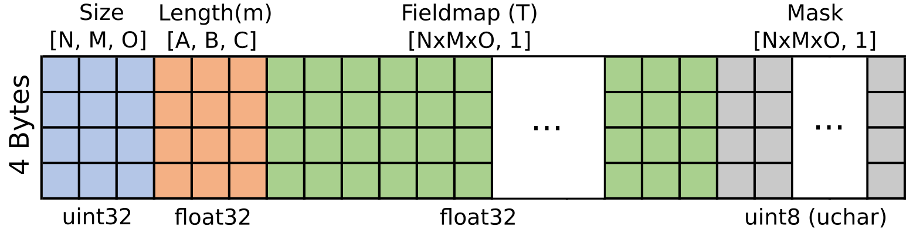
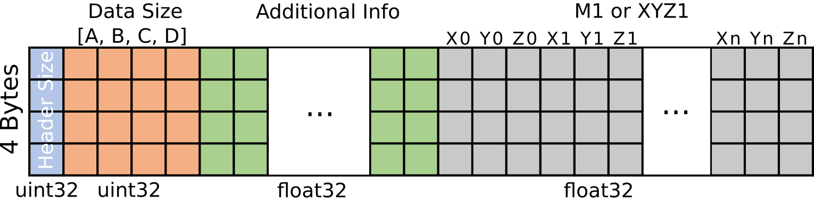

<a href={[https://github.com/Ehyaei/Open-Academic-Graph](https://github.com/aghaeifar/SpinWalk/)}>

# Spins Random Walk Simulator

[](https://github.com/aghaeifar/SpinWalk/releases)

This program aims to simulate the behaviour of spins under a certain MR sequence in a microvascular network. Breifly, the susceptibility variation between blood and tissue leads to local field inhomogeneity which accordingly can be used to generate an MR contrast. The program tries to perform a Monte-Carlo simulation over range of spins which are randomly distributed and move in presence of user defined magnetic field. Here are example plots obtained from the simulator where show BOLD sensitivity as a function of vessel size for Gradient Echo (GRE) and Spin Echo (SE) seqeuences.


Some [literature](#Literature) are provided as reference to get a better feeling of what are intended to get from this kind of simulations.

Simulator is written in C++ and utilizes CUDA to run in GPU. Therefore, it is possible to run a simulation within a short period of time provided that a good GPU presents. Simulator can detect all GPU cards, if there is more than one, and can distribute the task to run in parallel in multiple GPUs. This is helpful if you wan to run the simulator in HPC cluster with mutliple GPUs available in a node.

**This manual can be outdated. It is written based on commit [38ae16d043](https://github.com/aghaeifar/microvascular/tree/38ae16d043eb470c7c92450debe96bdc736a814a).**


## How to run
```
./SpinWalk config1.ini config2.ini ...
```
Several config files can be simulated sequentially. 
## Dependencies
- A C++ compiler supprting C++ 17
- CUDA driver (*nvidia-smi* and *nvcc --version* must run in terminal)
## How to compile

```
git clone https://github.com/aghaeifar/SpinWalk.git
cd SpinWalk
cmake -B ./build
cmake --build ./build --config Release
```

To check compute capability of your GPU run following command in terminal (if does not work since your GPU driver is old, try to find compute capability of your model [here](https://developer.nvidia.com/cuda-gpus)):
```bash 
nvidia-smi --query-gpu=compute_cap --format=csv
```
My GPU is NVIDIA RTX A4000 and the command above gives me:
```
compute_cap
8.6
```

## Configuration files
Configruation file is a text based [ini file](https://en.wikipedia.org/wiki/INI_file) used to provide simulation parameters for simulator. Simulator can accept more than one configuration to simulation several configurations. A configuration file can inherit from another configuration file to avoid writing repetitive simulation parmeters. All the possible parameters are provided in [config_default.ini](./config/config_default.ini). 

## Binary file format
### Fieldmap
The simulation requires at least one fieldmap and mask. The fieldmap unit is Tesla and must be normalized to the static magnetic field where is intended to be used for simulation (i.e., fieldmap must be calculated for 1T). The fieldmap file is stored in binary format and follows a specific structure:



1. Size = 3 unsigned int (3*4 bytes in total) representing 3D volume size (e.g., 1024 x 1024 x 1024).
2. Length = 3 single precision float (3*4 bytes in total) representing length in meter for each dimension (e.g., 0.001 x 0.001 x 0.001).
3. Fieldmap = n single precision float (n*4 bytes in total) where n = product of **size** array elements. Field map is stored in [column-major order](https://en.wikipedia.org/wiki/Row-_and_column-major_order).
4. Mask =  n unsigned char (n bytes in total) where n = product of **size** array elements. Mask is stored in column-major order.

The path to fieldmap is set in configuration file under section "FILES":


### Other inputs [optional]
M0 and XYZ0 are two additional inputs in configuration file which define starting magnization and initial spatial position of spins, respectively. These two are optional inputs, if not set or empty, spins will be positioned randomly with M0 = [0, 0, 1]. Please note that initial spatial positions must not intersect with mask. 

binary file containing M0 or XYZ0 is of size *3 * number of spins* single precision float which are stored in the file with following pattern:
```
x0 y0 z0 x1 y1 z1 x2 y2 z2 .... xn yn zn
```
unit for spatial position is meter.

### Outputs
The simulator stores the magnetization at echo time(s) as M1 and the optional spatial positions as XYZ1. The paths for both M1 and XYZ1 can be specified in the configuration file. These data are saved in a binary file using the following layout:



1. header size = 1 unsigned int32 (4 bytes in total) representing header size in byte
2. size = 4 unsigned int (4*4 bytes in total) representing 4D volume size. It is usualy 3 x number of spins x number of echoes x Number of vessel sizes
3. additional info = header size - 16 bytes containing additional information. Here, e.g., different scales for vessel size
4. M1 or XYZ1 = stored in column-major order

A MATLAB script is provided to read output files. See [read_spinwalk.m](./matlab/read_spinwalk.m).

## Literature
There are many nice papers published about simulation of BOLD signal in vessels network. A few are listed here for reference:

- Bieri O, Scheffler K. Effect of diffusion in inhomogeneous magnetic fields on balanced steady-state free precession. NMR Biomed. 2007 Feb;20(1):1-10. doi: 10.1002/nbm.1079. PMID: 16947639.
- Báez-Yánez MG, Ehses P, Mirkes C, Tsai PS, Kleinfeld D, Scheffler K. The impact of vessel size, orientation and intravascular contribution on the neurovascular fingerprint of BOLD bSSFP fMRI. Neuroimage. 2017 Dec;163:13-23. doi: 10.1016/j.neuroimage.2017.09.015. Epub 2017 Sep 8. PMID: 28890417; PMCID: PMC5857886.
- Boxerman JL, Hamberg LM, Rosen BR, Weisskoff RM. MR contrast due to intravascular magnetic susceptibility perturbations. Magn Reson Med. 1995 Oct;34(4):555-66. doi: 10.1002/mrm.1910340412. PMID: 8524024.
- Khajehim M, Nasiraei Moghaddam A. Investigating the spatial specificity of S2-SSFP fMRI: A Monte Carlo simulation approach. Magn Reson Imaging. 2017 Apr;37:282-289. doi: 10.1016/j.mri.2016.11.016. Epub 2016 Nov 24. PMID: 27890778.
- Weisskoff RM, Zuo CS, Boxerman JL, Rosen BR. Microscopic susceptibility variation and transverse relaxation: theory and experiment. Magn Reson Med. 1994 Jun;31(6):601-10. doi: 10.1002/mrm.1910310605. PMID: 8057812.
- Scheffler K, Engelmann J, Heule R. BOLD sensitivity and vessel size specificity along CPMG and GRASE echo trains. Magn Reson Med. 2021 Oct;86(4):2076-2083. doi: 10.1002/mrm.28871. Epub 2021 May 31. PMID: 34056746.
